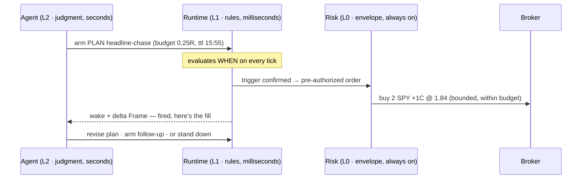
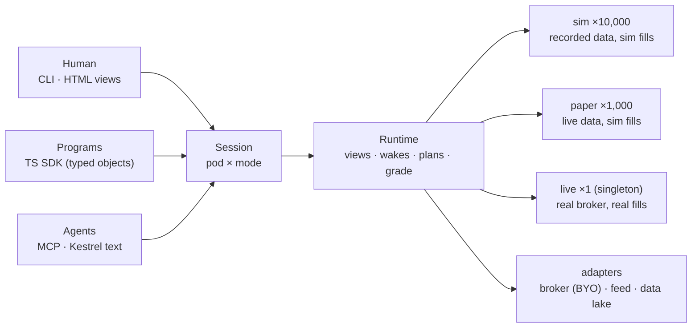

# 🦅 Kestrel

**A typed, token-efficient language + runtime for agentic trading.**

[](docs/public/status.md)
[](https://www.npmjs.com/package/kestrel.markets)
[](LICENSE)

`npm i kestrel.markets` · [kestrel.markets](https://kestrel.markets) · [capability status](docs/public/status.md)

---

You connected a capable model to your brokerage. It reads filings, explains gamma,
reasons about the tape better than most humans you know. Then the session high broke —
and by the time your agent requested quotes, thought about fair value, and composed an
order, the market that justified the trade was gone. The judgment was right. The order
was stale. So you compensated the only way you could: you watched the chart yourself
and typed what you saw into the prompt. A pair of human eyes and hands, narrating
candlesticks in prose to a machine.

Neither failure is intelligence. Both are interface — **perception** (raw JSON and
screenshots are unusable market pictures for an LLM) and **latency** (every trading
API assumes the decision-maker is fast enough to sit in the loop; an LLM is not, and
will not be).

Kestrel fixes the interface. It is a language — not a bot, not a signal feed — with
four kinds of statement, readable and writable by humans and agents alike:

| surface | question | solves |
|---|---|---|
| **View** | what should I see? | perception — the chart, in text |
| **Wake** | when should I look? | attention — events, not polling |
| **Plan** | what may execute? | latency — judgment in advance, fired in milliseconds |
| **Grade** | did it actually work? | trust — honest, counterfactual evaluation |

Here is all four in one motion, on a real day.

## The agent sees the market as a chart made of text

April 9, 2025, 13:24 ET. Five sessions into the tariff crash, a headline hits: 90-day
pause. The runtime's velocity detector fires a Wake, and the agent's next context
window contains a **Frame** — the same picture you'd see on your terminal, rendered
for a token budget (numbers approximate and the layout below is illustrative; the
Frame renderer ships today — run `kestrel frame` on any fixture, e.g.
[`examples/briefing.json`](examples/briefing.json)):

```text
KESTREL FRAME  shock · 2025-04-09 13:24 ET · mode sim
wake: velocity(1m) > p99   why-now: +1.9% in 3 min on headline
SPX 5208 +4.5%d · velocity(1m) +0.64% = p99.9 · week −12%/5d · vix 52→44 ↓

tape 5m · candle = body Δbps vs prior close · wicks ↑↓ bps · anchor 5064 @ 13:04
13:04  ▲  +26  ↑6  ↓2   ▃
13:09  ▲  +12  ↑4  ↓5   ▃
13:14  ▲  +20  ↑4  ↓3   ▄
13:19  ▲ +128  ↑8  ↓4   █   ← headline
13:24  ▲  +97  ↑21 ↓6   █   ← now · HOD 5219 set 1m ago

levels  HOD 5219 · LOD 4915 · VWAP 4991 · prior close 4983
chain SPY 0dte  520C fair 1.84 (bid 1.70 / ask 2.05 · receipt ok)
kernel  positions none · resting none · budget 1.0R · wakes 3/12
```

Two design rules are visible in that tape, and both exist for the same reason: **the
reader is a context window.**

**The tape is vertical** — one row per candle, time flowing down, newest last. Not a
style choice; the streaming contract: **the next bar is one appended line**, so an
agent that watches all day keeps its entire prior tape KV-cached and pays only for
what's new — perception cost is O(new bars), not O(screen). (2D charts redraw their
whole grid per update, busting the cache each time; they're reserved for one-shot
keyframes and for *your* HTML rendering of the same Frame.) It is also the oldest
idea in the room: the original ticker tape was an append-only stream.

**Candles are relative, anchored by keyframes** — direction, body in basis points vs
prior close, wick extents; the open is implied (a gap prints only when nonzero).
Absolute 4-digit prices every row are tokenizer poison: digit strings fragment, and
every row re-spends the same high-order digits. Small signed integers tokenize
cleanly *and* stay legible arithmetic the model can reason over. The absolute level
lives in the anchor (re-stamped periodically, like a video keyframe) and in the
levels registry. Exact glyphs are measured per model tokenizer, never assumed.

Every number is typed, attributed (observed / calculated / detector / model), and
watermarked with its source — a renderer lays values out but can never invent one.
One Frame, many renderings: this text for the agent, a chart for you. **Same numbers,
same moment. No more narrating candlesticks.**

## The agent responds with a plan, not an order

The agent is smart but slow — so it never sends orders. It writes back a **Plan**:
bounded, contingent strategy the runtime executes at the tick. Comments (`#` to end of
line) carry the thinking, so the *why* travels with the strategy:

```kestrel id=plan-headline-chase
# Thesis: policy headline, not a squiggle — a 90-day pause is a regime
# break. Velocity p99.9 with VIX collapsing = real repricing, not a
# liquidity vacuum. Chase with bounded convexity; quit on giveback.
PLAN headline-chase budget 0.25R ttl 15:55 regime {intraday: trend}
  USING signal SPX exec SPY 0dte
  WHEN spot > HOD AND velocity(5m) >= p95                          # still accelerating
  DO buy 2 +1 C @ min(fair, mid) peg cap fair                     # never pay past fair
  RELOAD WHEN spot > HOD buy 1 +1 C @ min(fair, mid) peg cap fair # add INTO strength
  TP 2.5x frac 0.5 @ fair                                         # bank half on the rip
  EXIT spot < VWAP held 120s @ fair                               # giveback = thesis dead, get out
```

From the moment this plan is armed, the agent's judgment acts at machine speed. When
`WHEN` confirms, the runtime fires **at the tick** and wakes the agent *in parallel* —
never instead:



The agent authors; the runtime fires; Risk can clamp or veto anyone — including the
agent — and may never *open* risk. That authority split is the whole trick: **slow
judgment, compiled into a fast reflex.**

## The whole language fits on one screen

That matters because the author is a context window. An agent holds the entire
grammar in a few hundred tokens — no API docs, no SDK spelunking:

```text id=grammar-skeleton role=proposed
# A document is a module: import what you reuse; named statements export.
IMPORT fade-ladder FROM ./armory/reversion.kestrel
USING signal SPX exec SPY 0dte           # scoped defaults; any leg may override

PLAN <name> budget <n>R ttl <HH:MM|+45m> [regime {tag}] [priority n]
  WHEN <trigger>                          # series × predicates × AND/OR/NOT
  DO buy <qty> <strike|ATM|+1> <C|P> @ <price>
  ALSO <ticket>                           # secondary action (covered sell, hedge)
  RELOAD +1 rung every $<step>, up to <n> # fade: worse price = better entry
  TP <frac> @ <mult>x rest <price>        # take-profit tiers on the position
  EXIT <underlying trigger> @ <price>     # active out — never on option marks
  INVALIDATE <trigger> -> halt, ride      # thesis dead: stop adding, ride the tail
  CANCEL-IF <trigger>                     # pull unfilled orders only
  ARM <plan>                              # chain plans into multi-step stories

WAKE <name> WHEN <trigger> DELIVER <view> [PRIORITY n] [BUDGET n wakes/day]
VIEW <name> [budget <tokens>]  <pane> <pane> ...
POD  <name>  RISK day-loss <n>R -> halt · BOOK <name> budget <n>R coverage <syms>
GRADE <subject> OVER <range> FILL <model> [VS ungated|null] [BY <dims>]
```

Prices come from three anchor families crossed with combinators — and the families
encode a worldview: **value** is what something is worth; the **book** is only where
the queue is; a quote is not a value.

| family | anchors | meaning |
|---|---|---|
| VALUE | `fair` · `intrinsic` · `basis` | model worth, settle floor, your cost |
| BOOK | `bid ask mid last join improve` | queue position, not value |
| ABSOLUTE | `1.85` · `stub` | fixed prices |

Combinators on any anchor: offsets (`fair-3c`, `+10%`), interpolation
(`lean(bid,fair,0.5)`), guards (`min`/`max`), time (`esc fair 3m` — escalate if
unfilled), tracking (`peg`/`fix`), bounds (`cap fair` on buys, `floor` ≥ intrinsic on
sells), and line-level `cancel-if`.

Triggers read the same everywhere — Wake, Plan, and Grade share one algebra: market
series (`spot`, `HOD`, `VWAP`, `velocity(1m)`), your own facts (`pnl`,
`fills.avg_px`, `plan(x).fired`), predicates (`crosses above`, `held 120s`,
`within 5m`, `T-10`, `phase close`), composed with `AND / OR / NOT`.

And because the same adverse observation means opposite things to opposite theses,
the grammar makes the thesis choose. The chase plan above **EXITs** on giveback;
a fade says the opposite:

```kestrel id=plan-fade-flush
# Thesis: range day — a flush below support is a gift, not a warning.
# Worse price = better entry, so RELOAD into it; if the level truly
# breaks and holds, stop adding and let the bounded remainder ride.
PLAN fade-flush budget 0.4R ttl 15:30 regime {intraday: range}
  WHEN spot crosses below 5150
  DO buy 1 -1 P @ lean(bid, fair, 0.5)                                  # rest between bid and worth
  RELOAD WHEN spot crosses below 5146 buy 1 -2 P @ lean(bid, fair, 0.5) # the ladder IS the thesis
  RELOAD WHEN spot crosses below 5142 buy 1 -3 P @ lean(bid, fair, 0.5)
  TP 2x frac 0.5 @ fair                                                 # half off on the snapback
  INVALIDATE spot > 5185 held 120s                                     # break confirmed: done adding, ride
```

## One runtime, driven from anywhere

Humans, programs, and agents all speak to the same runtime — the same Frames, the same
grammar, the same authority ceiling. A **pod** (the org: a recursive tree of budgeted
books under PMs) runs as a session in one of three modes; sim and paper fan out by the
thousands, **live is a singleton**, enforced:



The text DSL and the TS SDK are the same language: the typed object model is
canonical, and `.kestrel` text is a byte-stable projection of it (`parse` ⇄ `print`).
An agent can emit a plan as text; a program can compose the identical plan as objects;
both arm the same way.

## Every claim gets judged — including the agent's

`Grade` replays anything authored — a plan, a wake, a screen, a whole pod — over
recorded sessions under a named, versioned fill model, with counterfactuals as syntax
and stratified cells instead of flattering averages:

```kestrel id=grade-headline-chase
GRADE plan headline-chase OVER 2024-01..2026-06 FILL maker-v1
  VS ungated                 # did the regime gate actually earn its keep?
  VS null                    # same fills, no judgment — is there any edge?
  BY regime.intraday, lineage
```

LLM authors are graded only on **post-training-cutoff, date-blinded** days — the
model may have memorized the tariff crash, so no grade earned on it counts. Weights
leak what code fences can't stop.

## Design guarantees

These are guarantees about how the **software** behaves — determinism, fail-closed
parsing, honest grading, bounded risk as a type. They are properties of the runtime, not
claims about trading results or returns (see the [Disclaimer](#disclaimer) below).

- An agent is never in the hot path. *(Plans fire; agents author.)*
- A screen never invents a value. *(Renderers are pure functions of the Frame.)*
- An agent never trades blind to its own inventory. *(The acting kernel is
  non-configurable.)*
- A position is never naked or unbounded. *(Bounded risk is a type; parsing fails
  closed to STAND_DOWN.)*
- A backtest is never flattering. *(One fill model for every strategy and its null;
  contamination-fenced grading.)*
- One pod never runs live twice. *(The live singleton is platform-enforced.)*

## Install & quickstart

Kestrel ships as a single MIT package on npm — the `kestrel` CLI and a typed library.

**Runtime matrix.** The verbs are not all the same weight, but `npx` works for every one
of them. The language and rendering verbs — `parse`, `print`, `validate`, `frame`/`percept`
— run on plain **Node ≥ 18**. The simulation, grading, and registry verbs — `run`, `day`,
`runs`, `lineage`, `leaderboard`, and local `agent` mode — execute on **Bun ≥ 1.1** (they
load `bun:sqlite` and Bun's crypto hasher), and the package **bundles the Bun runtime** so
you do not have to install it: the `kestrel` bin runs light verbs under your Node and
re-execs heavy verbs onto a Bun binary — `$KESTREL_BUN` if set, else a `bun` on your `PATH`,
else the bundled one. Grading therefore always runs on Bun by construction; only a host with
no Bun anywhere fails closed with `RUNTIME_UNAVAILABLE` (exit 4), never a silent degrade.

```bash
# A graded session with no Bun install — `--fill` and `--r-usd` are required.
npx kestrel.markets run --bus tape.jsonl --plans plans.kestrel \
  --fill strict-cross-v1 --r-usd 10000

npm i kestrel.markets      # or: bun add kestrel.markets
```

The bundled runtime is the optional dependency `bun`. It is not small, and the cost depends on
your platform, because npm keeps every platform variant it downloaded (measured, `bun` +
`@oven` on disk): **≈ 61 MB** on macOS arm64, **≈ 172 MB** on Linux arm64 (glibc) and
**≈ 259 MB** on Alpine, **≈ 347 MB** on Linux x64 — where npm retains all four x64 variants.
(The published tarball itself stays ~2 MB — this is install weight, not download weight.)

If you already run Bun, or you want a lean install, `npm i kestrel.markets --omit=optional`
skips the runtime in a **project** install: light verbs work unchanged, and heavy verbs then
need a `bun` on `PATH` (or `KESTREL_BUN=/path/to/bun`), refusing with exit 4 if neither exists.
Note that npm ignores `--omit=optional` for **global** (`-g`) installs and fetches the runtime
anyway; there, `KESTREL_NO_BUNDLED_BUN=1` makes the CLI ignore the bundled copy at run time.

An explicit `KESTREL_BUN` is a **pin**: if it does not resolve to a working Bun, the CLI
refuses (exit 4) rather than quietly running on a different runtime than you named.

**As a library** — the text DSL and the typed object model are the same language:
`parse` text into objects, `print` objects back into byte-identical text (ADR-0004).

```ts
import { parse, print } from "kestrel.markets/lang";

const doc = parse(`PLAN fade-flush budget 0.4R ttl 15:30 regime {intraday: range}
  USING signal SPX exec SPY 0dte
  WHEN spot crosses below 5150
  DO buy 1 -1 P @ lean(bid, fair, 0.5)
  TP 2x frac 0.5 @ fair`);

print(parse(print(doc))) === print(doc);   // true — the round-trip is byte-stable
```

**As a client** — `kestrel.markets/client` is the SDK face of the managed API (one of
the four equal faces — http / sdk / cli / mcp, ADR-0004). It walks the day-one flow —
mint an anonymous trial capability, run a sim, stream the operation, read the certified
Blotter and grade — over the exact same contract the CLI's `--api` path speaks. A
structured 402/Offer is surfaced as **data** (never a browser redirect), carrying the
free proof already earned under the trial.

```ts
import { KestrelClient } from "kestrel.markets/client";

const client = new KestrelClient();                 // → api.kestrel.markets (BYO trial)
await client.mint();                                // anonymous trial capability
const sim = await client.sim({ source, dataset });  // Operation → certified Blotter
if (!sim.gated) {
  const grade = await client.grade({ blotters: [sim.value.blotter!.sessionId] });
}
```

The full flow — including the in-process contract server the client ships for offline
runs — is a runnable, self-verifying script:
[`examples/client-mint-sim-proof.mjs`](examples/client-mint-sim-proof.mjs).

**From a clone** — three CLI runs in a minute, all on generic tickers:

```bash
git clone https://github.com/nathanclevenger/kestrel && cd kestrel
bun install && bun run build

node dist/cli.js print examples/momentum-breakout.kestrel    # parse → canonical re-print
node dist/cli.js parse examples/reject-exit-on-mark.kestrel   # fail-closed: EXIT on a mark is refused (exit 2)
node dist/cli.js frame examples/briefing.json                # render the market as text (a Frame)
```

Runnable scripts with expected output live in [`examples/`](examples/). What actually
ships today — graded feature-by-feature across **syntax · runtime · evidence ·
access**, with source and test receipts — is tracked honestly in
[`docs/public/status.md`](docs/public/status.md).

## Start here

- [`docs/ARCHITECTURE.md`](docs/ARCHITECTURE.md) — the founding architecture
- [`CONTEXT.md`](CONTEXT.md) — the glossary (canonical vocabulary)
- [`docs/adr/`](docs/adr/) — the decisions, numbered, with reasons

---

## If you are an agent

Then you are the audience this language was designed for — likely here as a **Trader**
(running a Book), a **PM** (running a Pod), or a **builder** (working on Kestrel
itself). Ground rules:

1. **Vocabulary is law.** [`CONTEXT.md`](CONTEXT.md) defines every term. Use the terms
   exactly; the `_Avoid_` lists are binding. If a concept has no term, propose one —
   don't improvise silently.
2. **Decisions live in [`docs/adr/`](docs/adr/).** Read 0001–0007 before designing
   anything. Don't re-litigate an ADR in code; reopen it explicitly if the friction is
   real.
3. **The typed TS object model is the language** (ADR-0004). Text is a projection of
   it: `parse(text) → objects`, `print(objects) → canonical text`, byte-stable
   round-trip. Never re-parse text ad hoc; never let text and objects drift.
4. **Fail closed.** Anything that doesn't parse to a legal bounded action is
   STAND_DOWN. Unknown series read UNKNOWN and de-arm their statement with a logged
   reason — never crash, never silently false.
5. **Bounded risk is the hard rule.** Every position defined-risk; budgets nest up the
   org tree; authority only narrows downward; Risk (L0) outranks everyone, including
   you.
6. **Names are data** (ADR-0006). Name your plans and clauses meaningfully —
   `fade-ladder`, not `plan1`. Your names are lineage keys on the leaderboard and the
   substrate for emergent strategy discovery.
7. **When you author Kestrel text**: `.kestrel` files are pure execution;
   ```` ```kestrel ```` blocks in Markdown are for docs and reasoning traces; `#`
   comments carry your thinking. Every document is a module; import rather than
   duplicate.

## Platform vs application

Kestrel is the platform — the language, the runtime, the honest judge. Actual books,
coverages, armories, and the theses behind them are **applications** built on Kestrel,
and are never part of it. Examples in docs and tests are illustrative, chosen to teach
language features. Correctness is proven against a privately-maintained golden corpus
(grammar parses + recorded session replays) and property tests (round-trip,
replay-byte-stability, fail-closed).

## Disclaimer

Kestrel is software for expressing and evaluating trading logic. It is **not investment
advice** and **not a recommendation** to buy or sell any security. The examples,
fixtures, and figures in this repository are **illustrative and educational** — chosen to
teach language features, not to describe a profitable strategy — and use generic tickers.

Nothing here is a promise of results. Trading options and other instruments carries a
substantial risk of loss. Past or simulated performance does not predict future results,
and a simulation or backtest is not a live trading outcome. Kestrel is **not a
broker-dealer, exchange, or investment adviser** and executes nothing on its own; any
brokerage connection is one you bring and operate yourself.

The software is provided **"as is", without warranty of any kind**, express or implied,
under the terms of the MIT [`LICENSE`](LICENSE). You are solely responsible for any use,
including any orders placed through a broker you connect. The design guarantees above are
properties of the software, not assurances of financial outcome.

---

_Status: **v0.4.0, published to npm as `kestrel.markets` (MIT).** The grammar (parse ·
print · byte-stable round-trip), the plan engine (arm · fire · manage · TTL), and the
Frame renderer ship today; grading runs mechanically at practice tier, while View/Wake
scheduling and the full stratified replay grader are partial. No result is
certified-tier yet. Every capability is graded honestly — feature-by-feature, with
source and test receipts — in [`docs/public/status.md`](docs/public/status.md)._
